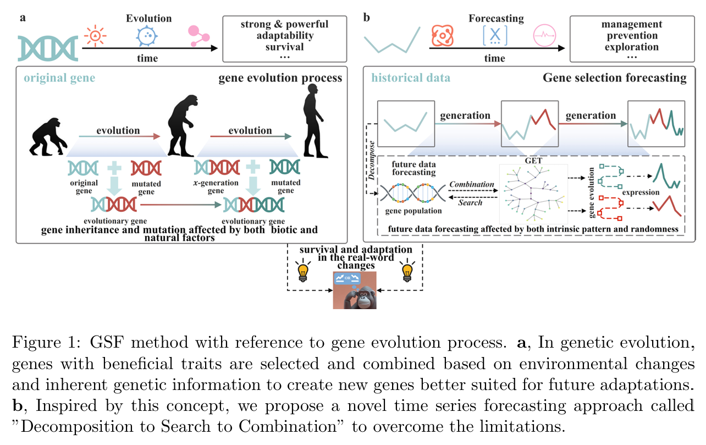
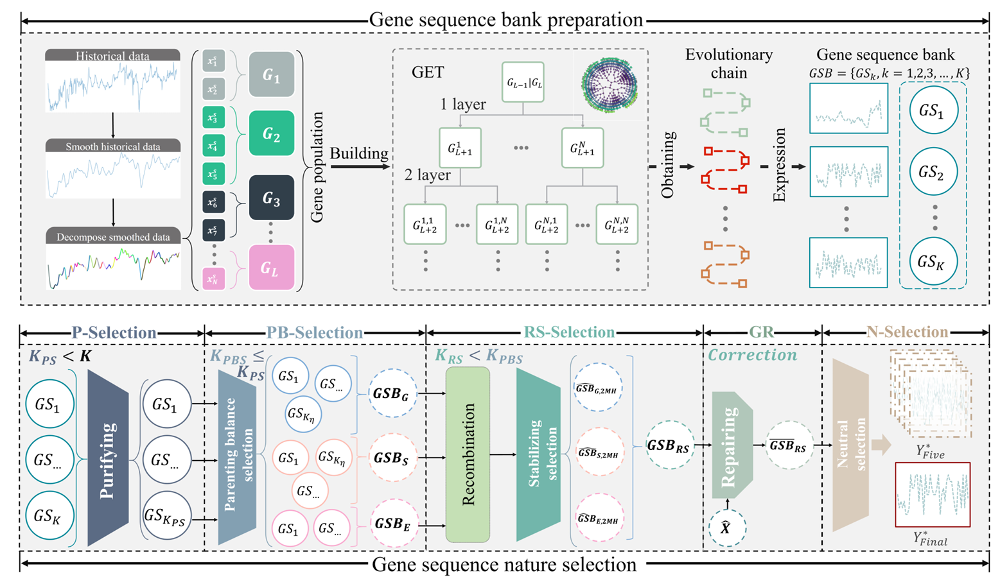
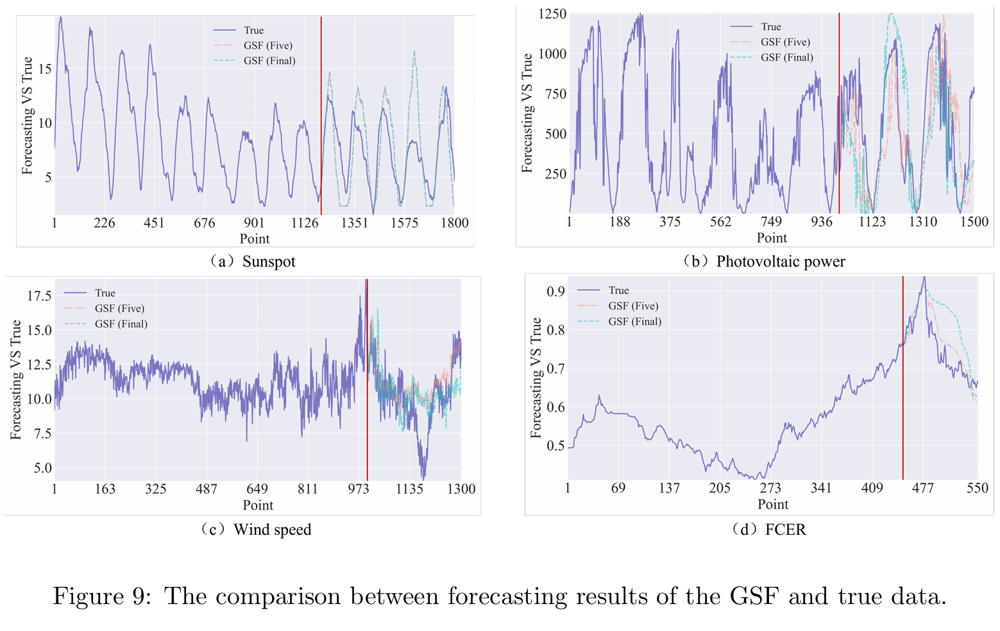
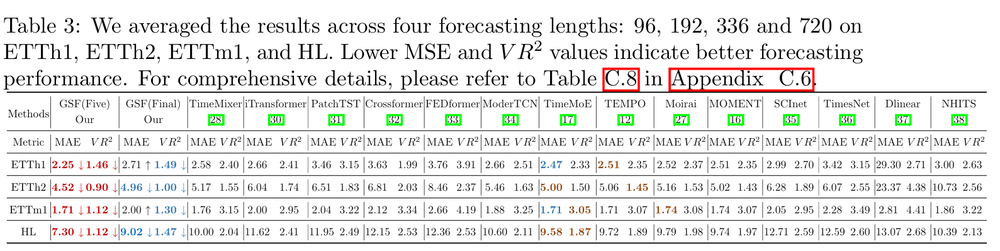

# GSF
Accurate forecasting on few-shot learning with a novel inference foundation model.

## Our Paper
Accurate forecasting with limited data is challenging, especially for deep learning models that need large datasets. While Meta-learning (MeL) and Transfer Learning (TL) are useful, they have limitations: MeL assumes shared task structures, which may not apply to unique tasks, and TL requires domain similarity, often failing when distributions differ. This paper shows that future trends are embedded in historical data, but deep learning models struggle to learn these from small datasets.

To address this, we propose a novel model inspired by gene evolution. It decomposes historical data into subsequences (genes), selects optimal genes, and combines them into evolutionary chains based on temporal relationships. Each chain represents potential future trends. After five generations of selection and recombination, the best gene sequence is identified for forecasting.

## GSF structure overview
We propose a novel learning paradigm that shifts the focus from direct mapping to discovering the evolution chain of future data. This approach, termed "Decomposition to Search to Combination" (DSC), is illustrated in Fig. 1 (b) and is inspired by genetic evolution, as shown in Fig. 1 (a). Specifically, given historical data, our approach explores the range of feasible future data and selects the best forecasting result from these possibilities. This method emphasizes understanding the evolutionary pathways of future data rather than merely mapping from past to future.





Our approach starts by decomposing historical data into subsequences (genes) to create a gene population. Then, these genes are analyzed to select the optimal ones with strong statistical characteristics. These selected genes are combined based on their temporal relationships to form multiple evolutionary chains. We introduce the Gene evolution tree (GET) to facilitate this search and combination process, producing a Gene sequence bank (GSB) with numerous reliable gene sequences (GSs). Additionally, guided by the concept of natural selection, this paper introduces a method to filter GSs in GSB and obtain the protagonist gene sequence (PGS) that is as close to the true value as possible. Therefore, in this paper, we term the entire methodology as gene selection forecasting (GSF). The GSF not only demonstrates good prediction performance on limited training data, but also offers interpretability.





## Main Results


Our GSF achieves the consistent SOTA performance on time series forecasting tasks with better efficiency.







## Get Started

1. Install Python 3.7 and necessary dependencies. 
```
pip install -r requirements.txt
```
2. Download data. You can obtain all datasets from [[Times-series-library](https://github.com/thuml/Time-Series-Library)].

3. Limited time seires forecasting tasks.
 
We provide the limited time seires forecasting tasks and experiment scripts can be found under the file 'Ex1.ipynb'. To run the code on Ex1, just run the following command:

```
cd ./Ex1.ipynb
```

4. few-shot time seires forecasting tasks.

We provide the few-shot forecasting experiment  and experiment scripts can be found under the folder `Ex2.ipynb`. Please run the following command:

```
cd ./Ex2.ipynb
```

5. convtional time seires forecasting tasks.

We provide the convtional experiment and experiment scripts can be found under the folder `Ex3.ipynb`. To run the code on ETTh2, just run the following command:

```
cd ./Ex3.ipynb
```

## Acknowledgement

We appreciate the following github repos a lot for their valuable code base or datasets:

https://github.com/thuml/Time-Series-Library


